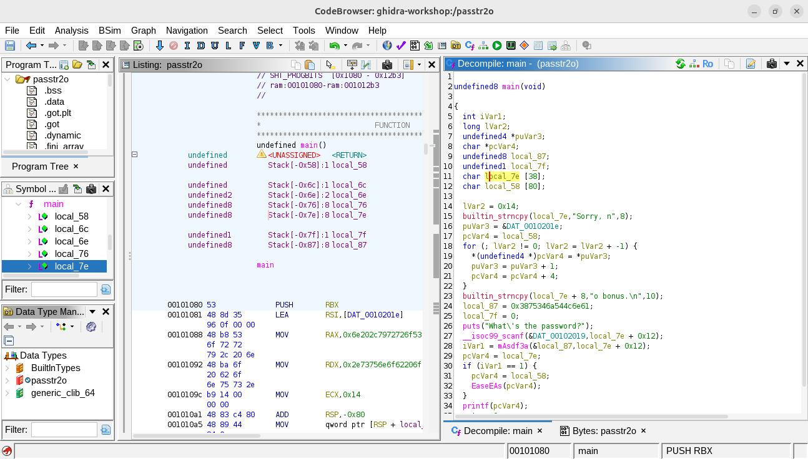
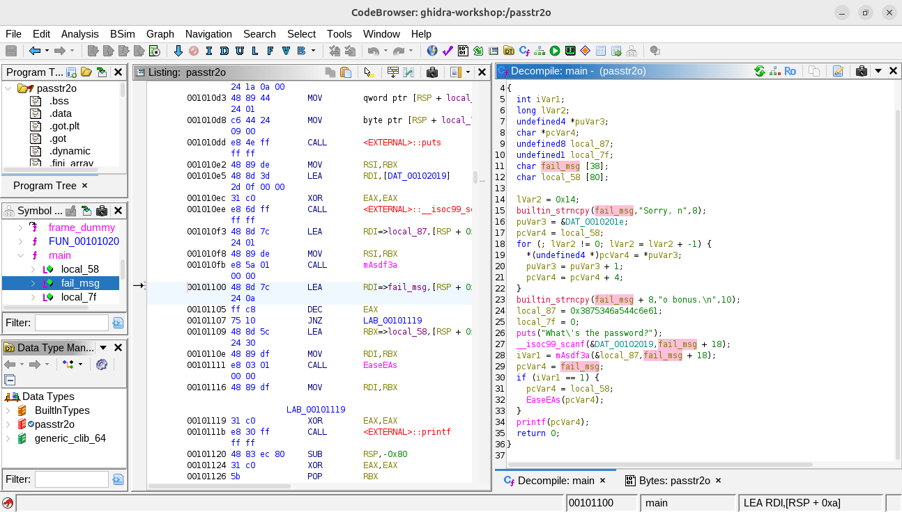
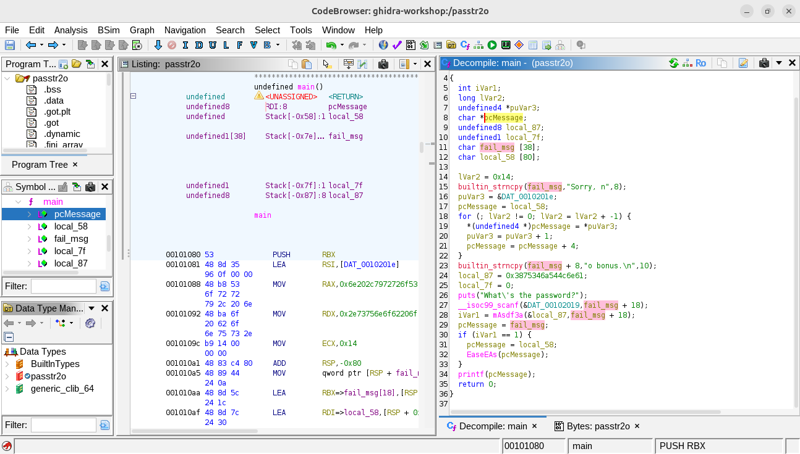
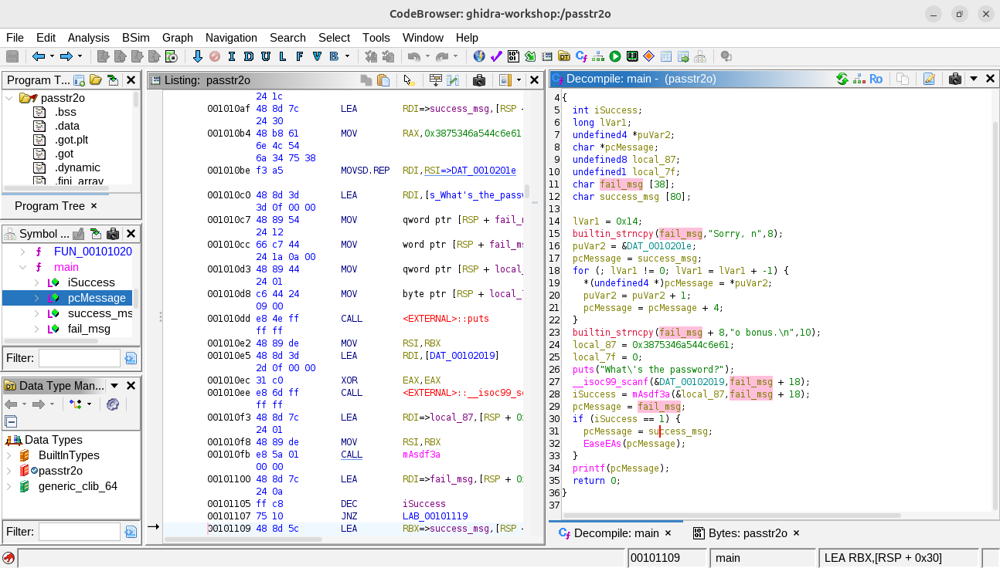
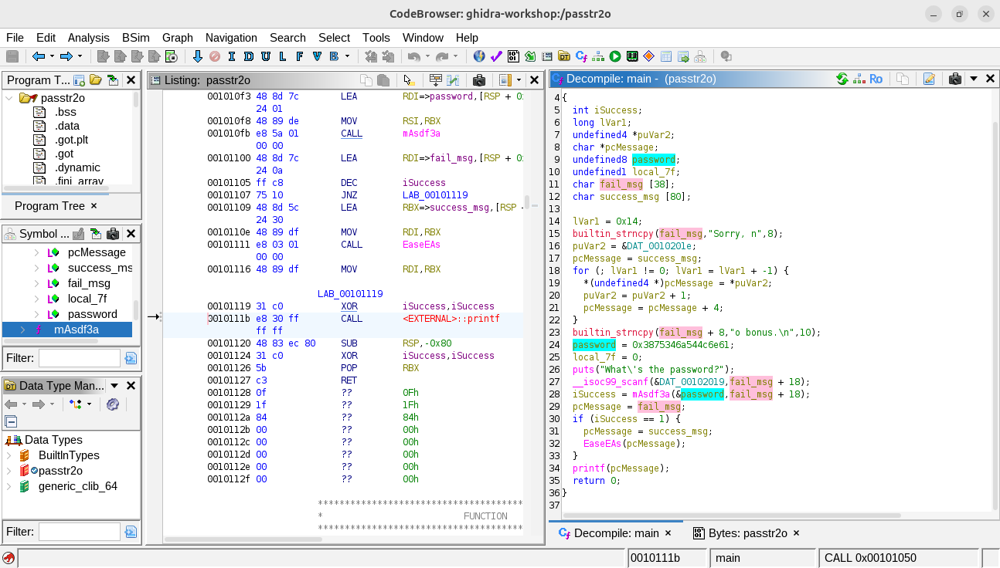
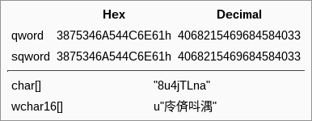
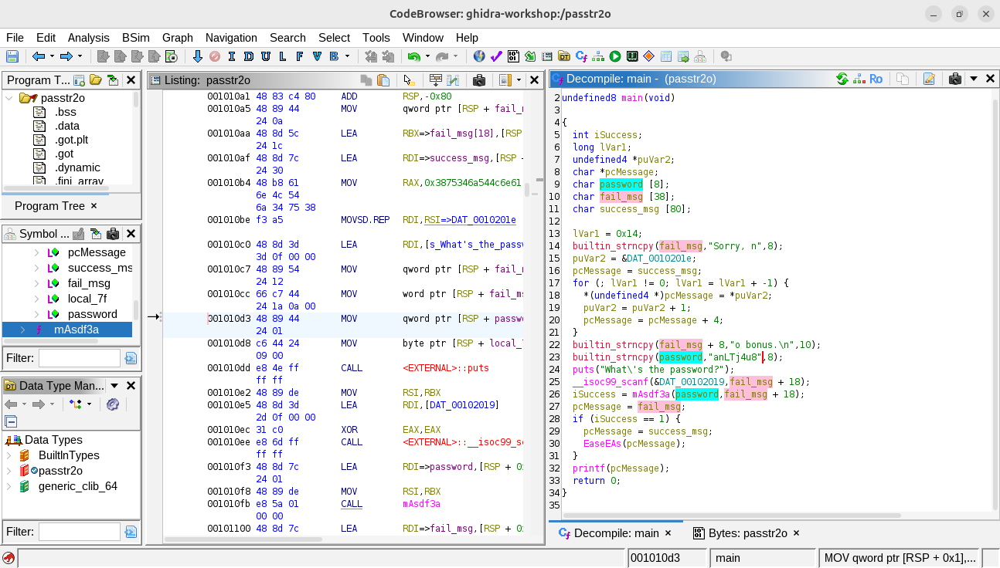
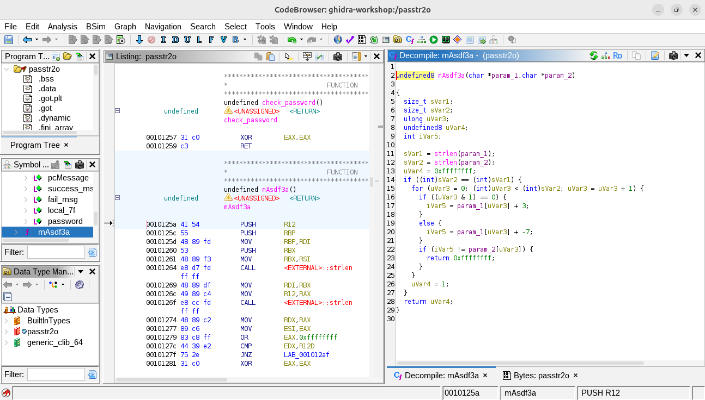
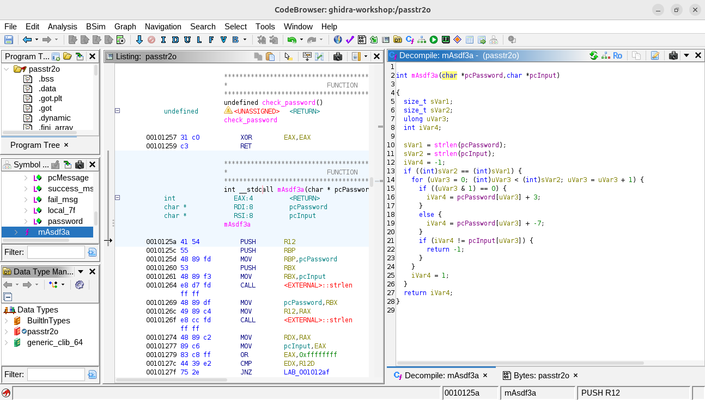
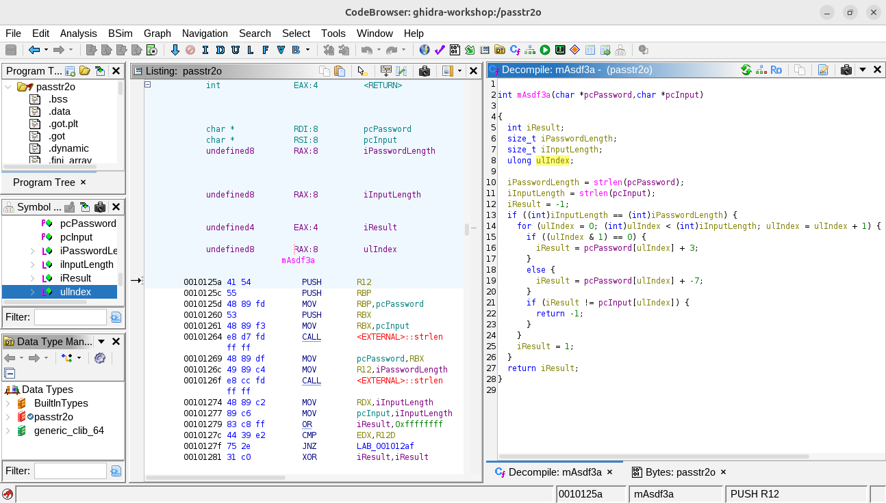

# It's Alive!

## a) lab1

As usual, I want to see what is the problem.

```bash
$ wget https://terokarvinen.com/application-hacking/lab1.zip
$ unzip lab1.zip
$ cd lab1/
$ ./gdb_example1
Khoor/#zruog1
Segmentation fault
```

The program prints a text, then gets the segmentation fault&mdash;or prints *"Segmentation fault"* literally&mdash;and exits. I just want to make sure the program does not print the error string itself. Who knows!

```bash
$ ./gdb_example1 || echo $?
Khoor/#zruog1
Segmentation fault
139
```

Because this task is only about investigating the root cause of the problem and how to fix it, I'll go straight to the source code. The first and only thing, which catches my eyes, is one of the big mistakes of programming: *dereferencing a NULL pointer.* 

```c
int main()
{
  char * bad_message = NULL; // Okay...
  char * good_message = "Hello, world.";

  print_scrambled(good_message);
  print_scrambled(bad_message); // Wait! On purpose???
}
```

It is such the most common mistake that every developer makes or faces in their professional career. It leads to the error we met at the beginning: *segmentation fault*. As far as I know, this error has many other names: [memory access violation](https://learn.microsoft.com/en-us/shows/inside/c0000005), null pointer exception (Java), null reference exception (C#). There is even a story about it: [the billion-dollar mistake](https://en.wikipedia.org/wiki/Null_pointer#History). The error, when it happens, will crash the program immediately. This behavior is done by modern operating systems&mdash;such as Windows, Linux, Mac OS&mdash;to prevent any further damage the error might cause.

**How to fix:** Actually I don't know what is the exact purpose of Lari's asking a question but with an answer in there. Probably it is simply **to remove the lines that cause the problem.** It is about doing only the good things, isn't it?

* Fix the source code

```c
int main()
{
  char * good_message = "Hello, world.";

  print_scrambled(good_message);
}
```

* Re-compile and run

```bash
$ gcc -Wall -g -o gdb_example1_fixed gdb_example1.c
$ ./gdb_example1_fixed || echo $?
Khoor/#zruog1
```

## b) lab2

> ***TL;DR;*** `dgOMm-x1` is the password and `FLAG{Lari-rsvRDx04WMBZpuwg4qfYwzdcvVa0oym}` is the flag.

Let's see what we have in the zip file.

```bash
$ wget https://terokarvinen.com/application-hacking/lab2.zip
$ unzip lab2.zip
$ cd lab2
```

Well, it's the same old passtr program, I guess.

* passtr

```bash
$ ./passtr
What's the password?
test
Sorry, no bonus.
$ strings passtr
...
sala-hakkeri-321
Yes! That's the password. FLAG{Tero-d75ee66af0a68663f15539ec0f46e3b1}
Sorry, no bonus.
...
$ ./passtr
What's the password?
sala-hakkeri-321
Yes! That's the password. FLAG{Tero-d75ee66af0a68663f15539ec0f46e3b1}
```

* passtr2o

```bash
$ ./passtr2o
What's the password?
test
Sorry, no bonus.
$ strings passtr2o
...
(nothing useful)
...
$ file passtr2o
passtr2o: ELF 64-bit LSB pie executable, x86-64, version 1 (SYSV), dynamically linked, interpreter /lib64/ld-linux-x86-64.so.2, BuildID[sha1]=c83fca0527d609d8f3533ab2a9bd7fdcbe228a0c, for GNU/Linux 3.2.0, not stripped
```

Interesting! There is no low hanging fruit here. It's time to open Ghidra and let's see what we can explore there.



Code is easier to read if variables have their meanings. Let's follow me to see how I *decode* to read the code.

Variable `local_7e` contains part of fail message, `"Sorry, no"`&mdash;I rename it to `fail_msg`. Line 15 and 23 means that, after those, this variable now contains the whole fail message&mdash;`"Sorry, no bonus.\n"`, exactly 18 characters. In addition, this variable is an array of 38 characters in length. Therefore, 20 remaining allocated memory will contain something else. So I mark it using Ghidra's Highight feature and convert all `0x12` (hex) to `18` (dec) for better understanding.



Based on the behavior of the program, and the main logic, I'm quite sure there is only one `printf` called at line 34. That means that, `pcVar4` should be the message to be printed&mdash;I rename it to `pcMessage`. Wow, a lot of `pcMessage` appear. It seems this variable is used multiple times with different purposes&mdash;Hey developer, single responsibility principle, please! 



Anyway, at this time, I only want to focus on how the fail/success message is printed out. So I trace from line 34, where `printf` is called, backward to where the `pcMessage` variable changes its role, or in another words, it is assigned a new value. And, ta-da!

```c
Line 29:  pcMessage = fail_msg;
Line 30:  if (iVar1 == 1) {
Line 31:    pcMessage = local_58;
Line 32:    EaseEAs(pcMessage);
Line 33:  }
Line 34:  printf(pcMessage);
```  

Things become much clearer, don't they? `pcMessage`  is now first assigned to the fail message; if `iVar1 == 1`, it will be another message. What can be *another message*? It's definitely the success message&mdash;I'm 100% sure! Now I have two new variable names, `iVar1` to `iSuccess`, and `local_58` to `success_msg`.



I know I'm close to the finish line. Tracing the `iSuccess` variable can give me what I want&mdash;the hidden password, and the flag. Let's do that! I trace the variable to where it is assigned a value.

```c
Line 28:  iSuccess = mAsdf3a(&local_87,fail_msg + 18);
```

Gotcha! It is `mAsdf3a`-ing between `&local_87` and `fail_msg + 18`&mdash;the input, right? To make sure, I find all the `fail_msg + 18` in the code. Until I find this line

```c
Line 25:  __isoc99_scanf(&DAT_00102019,fail_msg + 18);
```

A-ha! `scanf` is a function in C which reads the user input, and stores it into&hellip;`fail_msg + 18`. Exactly what I predicted. 

`mAsdf3a` should be *verifying* or *comparing*. And, `&local_87` should be&hellip; **the password**. Yes! `password` must be the name of its. And of course, it deserves a highlight&mdash;*as bright and shiny as the light at the end of a passage!* 



Trace it! The finish line. 

```c
Line 24:  password = 0x3875346a544c6e61;
```

By hovering on the hex value that is assigned to the `password` variable, I get this information. 



`8u4jTLna`&mdash;the password, it must be! I open a terminal and try it, waiting for the success message popping up. 

```bash
$ ./passtr2o
What's the password?
8u4jTLna
Sorry, no bonus.
```

Oh no!&mdash;I feel a glimpse of dissappointment. Don't give up!&mdash;I think to myself&mdash;The victory is near. I continue the journey by *retyping* the `password` variable so that the hexes become a string, or an array of character&mdash;or whatever, as long as it's not a sequence of hexes. 



Wait! Something wrong. `8u4jTLna` becomes `anLTj4u8`. It's weird. But you know, who cares! Maybe, this time&hellip;

```bash
$ ./passtr2o
What's the password?
anLTj4u8
Sorry, no bonus.
```

Well, it's not that easy!&mdash;I must admit. But, if it's that easy, it's not challenging any more, isn't it?

The remaining clue is the `mAsdf3a` function. Let's dive into it.



We already know its signature, right? Let's modify it for better code readability.



Everthing becomes sharper. Based on its flow of logic, I rename all the varibales that I can regconize its purpose. 



Well, it's hard to explain all the logic. It's just about *obfuscating* the password, and it's kind of complicated. So instead of explaining the logic, I think I will write a program to simulate the logic and it will print the password. It must be easier for us to understand&mdash;or, we don't need to know it anyway!

The logic of this *helper* program&mdash;let's call it a *keygen*&mdash;is slightly different from the original `mAsdf3a` function. Because I only want to print the password, I *void* the function (i.e. change its return type to `void`), and replace all `return` command with `printf`. Then, I remove all unnecessary codes such as the `pcInput` parameter, unused variables, dead code, etc. Finally, I compile it and name it `passtr2o_keygen`.  

```bash
$ gcc -Wall -o passtr2o_keygen passtr2o_keygen.c
```

* Source: [passtr2o_keygen.c](lab2/passtr2o_keygen.c)
* Binary: [passtr2o_keygen](lab2/passtr2o_keygen)

Now, let's try.

```bash
$ ./passtr2o_keygen 8u4jTLna
;n7cWEqZ
$ ./passtr2o                
What's the password?
;n7cWEqZ
Sorry, no bonus.
```

One more try.

```bash
$ ./passtr2o_keygen anLTj4u8
dgOMm-x1
$ ./passtr2o
What's the password?
dgOMm-x1
Yes! That's the password. FLAG{Lari-rsvRDx04WMBZpuwg4qfYwzdcvVa0oym}
```

Hooray! I did it! I found the password, and the flag!

# References

* Microsoft Inside Show 2018. Access Violation C0000005. Jan 29, 2018. URL: https://learn.microsoft.com/en-us/shows/inside/c0000005. Accessed: February 9, 2026.
* Wikipedia 2026. Null pointer. January 30, 2026. URL: https://en.wikipedia.org/wiki/Null_pointer#History. Accessed: February 9, 2026
* Wikipedia 2026. Segmentation fault. January 12, 2026. URL: https://en.wikipedia.org/wiki/Segmentation_fault. Accessed: February 9, 2026.